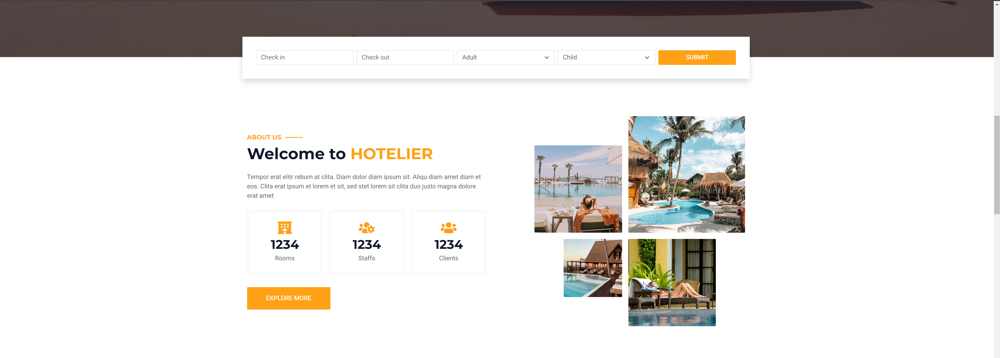
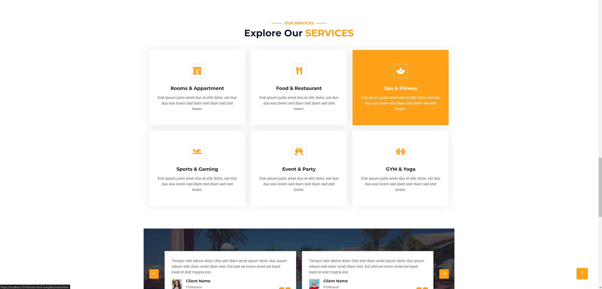
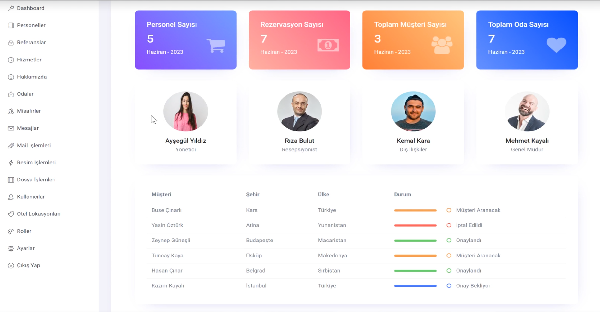
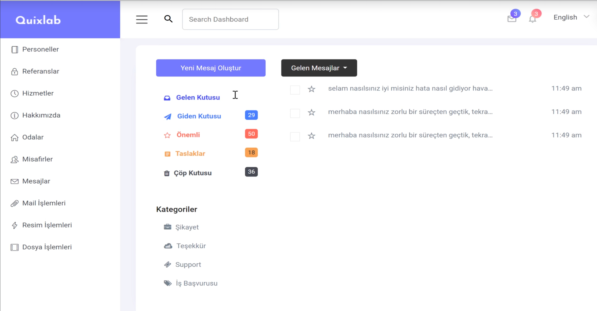
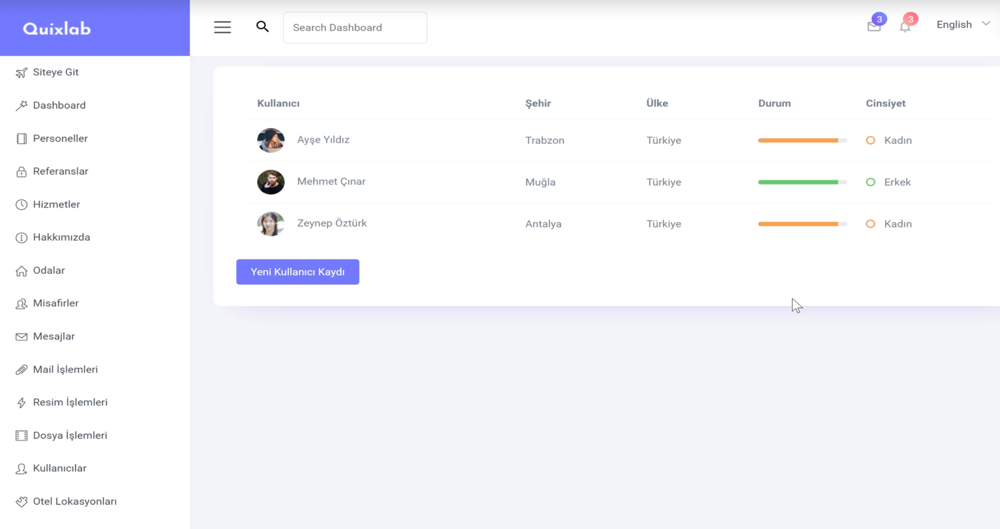

# Content of the 24-hour hotelier project

- Asp.Net Core Api
- Asp.Net Identity
- Swagger
- Postman
- Api Consume
- Rapid Api
- Json Web Token
- Login
- Register
- AspNet Core 8.0
- Fluent Validation
- N Tier Architecture
- DTO Layer
- Mvc
- Deploy
- Entity Framework Core
- Repository Design Pattern
- Mail Sending Operations

  # A few pictures of the project.
  
  <figure>
    <h2>Images of the site</h2>
        
        
        
       
    
    

    <h2>Admin images of the site</h2>
    
    
    
  </figure>
